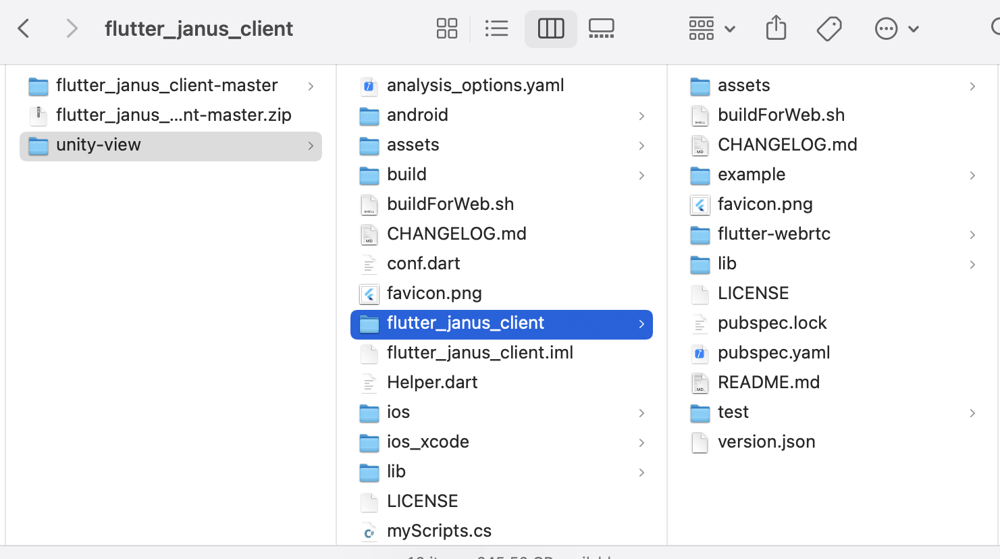
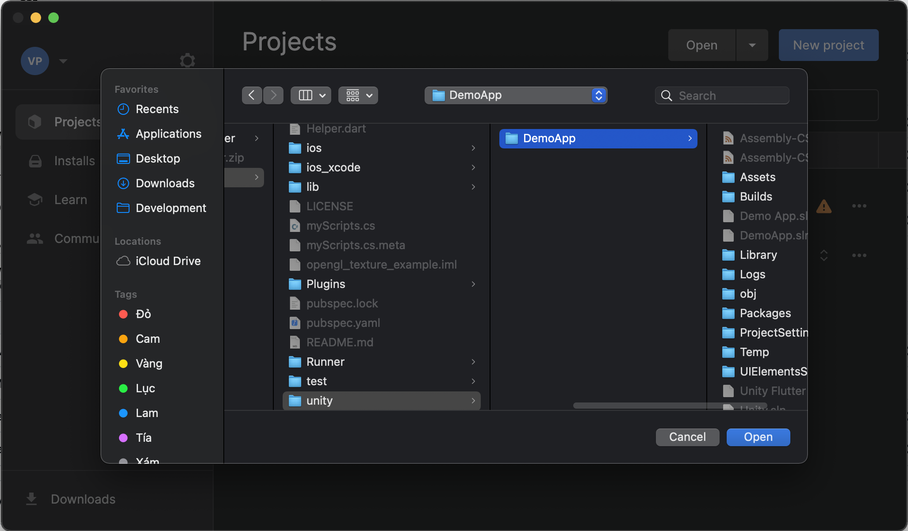
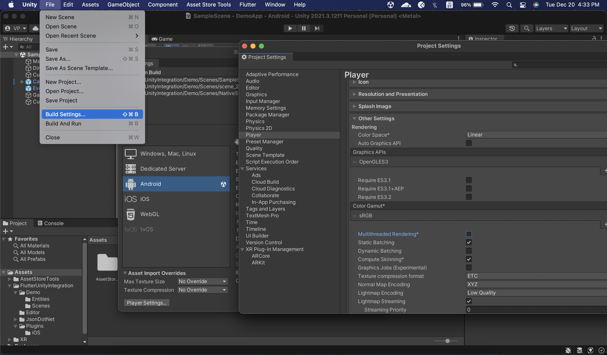
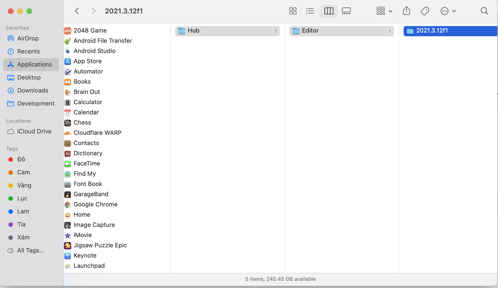

# Rsupport app

Setup flutter app to display video call from Janus server on Unity view

# Setup guide

Clone main source code at https://github.com/rsupport-mobile1-research/unity-view
- Cmd: git clone https://github.com/rsupport-mobile1-research/unity-view.git

Move to unity-view folder and clone janus client source code into unity-view folder at https://github.com/rsupport-mobile1-research/flutter_janus_client
- Cmd: cd unity-view & git clone https://github.com/rsupport-mobile1-research/flutter_janus_client.git

Move to flutter_janus_client folder and clone webrtc source code into flutter_janus_client folder at https://github.com/rsupport-mobile1-research/flutter-webrtc
- Cmd: cd flutter_janus_client & git clone https://github.com/rsupport-mobile1-research/flutter-webrtc.git

* In case you need to do some changes, please create a new branch for which part you need to edit. For example, I want to do some change for Webrtc I will create a new branch for main to do it from this repo https://github.com/rsupport-mobile1-research/flutter-webrtc

# Launch code

Build androidlibrary from Unity
. Install Unity https://unity.com/download
. Open source code Unity in unity/DemoApp

Config build setting for android on Unity. Select File -> Build Settings. In the window, select Android platform and click on Player Settings below of the window. Select Player and find Multithreaded Rendering* option. We need to disable this option.

Close the window and click on Switch Plaform on Build Settings popup & close the popup. Select Flutter -> Export Android Plugin. After done this step we will see unityLibrary under Android folder.

Continue to change config NDK on android. We need to add ndk.dir in local.properties of android source code unity-view/android/local.properties with ndk.dir=/Applications/Unity/Hub/Editor/[ndk version]/PlaybackEngines/AndroidPlayer/NDK

Open unity_view folder by android studio and start an android device to build the app.

** Reference docs: https://github.com/juicycleff/flutter-unity-view-widget
